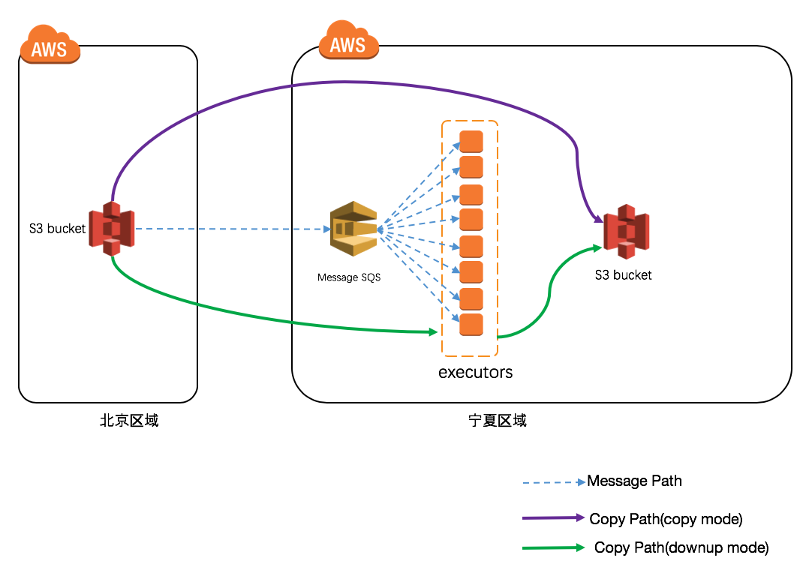

AWS S3 Tools
============

本工具用于S3桶间的迁移，对于跨区域和跨账户场景同样适用。   
本工具支持迁移及迁移后的校验。

#免责说明   
此方案为patsnap贡献，已在其生产环境中得到验证。但我们仍然无法保证方案的通用性，建议您在测试过程中使用此方案，生产环境使用请自行考虑评估。   
当您对方案需要进一步的沟通和反馈后，可以联系 nwcd_labs@nwcdcloud.cn 获得更进一步的支持。
欢迎联系参与方案共建, 也欢迎在 github 项目issue中留言反馈bugs。


# 依赖包

Python 3.5+

```
pip install -r requirements.txt
```

# 迁移

## 原理架构




## 描述

这是一个特别适合于大量小文件场景的S3桶快速迁移工具。对于大容量的桶而言，aws官方的`aws s3 cp`命令受限于S3 list的效率;`s3-dist-cp`EMR工具同样无法达到很高的效率。  

本工具提高了s3 list的效率，并使用SQS队列来提高并发，支持不同的迁移模式并支持迁移过程的校验。

我们通过使用500个executor在一天内完成了2亿个对象（大约2TB)的迁移；通过使用1000个executor在6小时内完成了7千万个对象（大约7TB)的迁移。  

支持如下s3对象的list方法：

- S3 List Object: 使用 list_objects API
- S3 Inventory: 在迁移前您需要打开S3 inventory的功能


## 配置


配置文件为config.yml. 您也通过自行编写环境变量文件进行覆盖。

支持的环境变量包括：   

| 参数 | 填写说明 |
| :----------------------------------| :----------------------------------- |
| INVENTORY_PROFILE_NAME  |用于操作s3 inventory的aws profile名 |
| INVENTORY_REGION_NAME    |inventory文件所在区域 |
| INVENTORY_AWS_ACCESS_KEY_ID |      用于获取inventory文件的access key  |
| INVENTORY_AWS_SECRET_ACCESS_KEY |  用于获取inventory文件的secret access key |
| COPY_PROFILE_NAME |用于操作s3 copy objects的aws profile名 |
| COPY_REGION_NAME | copy 操作所在区域 |
| COPY_AWS_ACCESS_KEY_ID | 用于copy操作的access key |
| COPY_AWS_SECRET_ACCESS_KEY | 用于copy操作的secret access ke  |
| QUEUE_NAME_PATTERN | SQS队列的命名模式  |
| QUEUE_NUM | 队列数量  |
| DEAD_QUEUE_NAME | SQS死信队列名  |
| MAX_RECEIVE_NUM | 消费者每次从消息队列中最多获取的消息数量  |


使用 `--config-file` or `-c` 指定配置文件名   
使用`--env-file` or `-e`指定.env文件  

## 使用

### 初始化 SQS 队列

我们使用多条队列来避免单一队列被阻塞的风险。您可以通过在config.yml中设置`sqs.queue_num`值来指定队列个数。  

创建队列和死信队列：

```
python s3_tools.py init
```

### 列出所有需要迁移的s3对象并将对象信息发往队列

使用 ObjectLister：

```
python s3_tools.py commander -s <source_bucket> -t <target_bucket>
```

使用InventoryLister：

```
python s3_tools.py commander -m s3://<path-to-manifest-file>/ -s <source_bucket> -t <target_bucket>
```

ObjectLister和InventoryLister是获取s3对象列表信息的两种方案。前者使用list_objects API，简单易用；后者使用S3 inventory manifest文件来列举文件，需要您提前设置inventory并等待manifest文件生成。后者适用于海量数据的场景。   


| 参数 | 填写说明 |
| :----------------------------------| :----------------------------------- |
| --manifest-path, -m |  S3 inventory的manifest文件路径, 此处不设置的话将默认使用objectlist模式   |
| --source-bucket, -s |  源桶名；此处不设置的话默认使用inventorylister模式 |
| --target-bucket, -t |  目标桶名 |
| --batch-num, -b | 1条消息中的对象数量  |
| --prefix |object lister模式中可设置前缀 |
| --tmp-dir | 用于下载文件的临时目录名 |
| --owner| 以object lister的role操作 |
| --no-owner|  以与object lister不同的role操作 |


### 启动executor从消息队列中拉取消息并执行对象复制

```
python s3_tools.py  executor
```

| 参数 | 填写说明 |
| :----------------------------------| :----------------------------------- |
| --mode: `copy`   | 是使用boto3 copy_object API进行文件拷贝  |
| --mode: `downup` |是使用下载再上传的方式   |
| --mode: `check`  |使用Etag做校验，如果fail则发送消息至死信队列 |
| --queue-num, -n | 指定从哪条队列接收消息。如不指定，默认为随机。 `-1`用于停止接受消息并需要和`-d`连用  |
| --including-dead, -d | 从死信队列接收消息, 同时使用 `--queue-num=-1` 和 `--including-dead` 将会只从死信队列接收消息 |
| --verify, -v | 在copy文件操作前增加校验环节，会导致程序执行时间变长，但可用性变高 |   
| --sleep-sec | 没有消息时的sleep时长  |
| --modified-since | 设置具体时间。如果文件的最终修改时间晚于此处设置的时间，则执行copy操作 |   
| --not-modified-since | 设置具体时间。如果文件的最终修改时间早于此处设置的时间，则执行copy操作 |
| --tmp-dir |  指定一个临时目录用于存储临时文件 |
| --queue-name-pattern | 工作队列的命令模式，用正则表达式语法描述  |
| --dead-queue-name | 死信队列名 |
| --max-receive-num | 每个executor每次最多能取的消息数量 |


这条命令可以在ECS中运行以获得高并发性。使用本项目源码中的Dockerfile来构建docker镜像。 使用本项目源码中的templates/cloudformation.template模板来创建任务。     

# 测试

使用pytest进行测试.
```
pytest
```

# 常见问题

## 使能S3 inventory

在bucket->Management->Inventory页面中配置inventory,指定输出为csv格式。我们建议您在选项中enable `Size`, `Last modified date`, `Storage class` 和`ETag`。结果会在您指定的目录下生成文件列表信息和manifest文件。  


## Access denied 和 S3 bucket 策略设置

我们默认您使用同样的profile来操作源bucket和目标bucket.如果您的源bucket和目标bucket在不同的aws账户，您需要增加如下的桶策略来执行跨账户复制操作：   

```
{
    "Version": "2012-10-17",
    "Id": "Policy1535615055992",
    "Statement": [
        {
            "Sid": "allow get",
            "Effect": "Allow",
            "Principal": {
                "AWS": "arn:aws-cn:iam::<target bucket account>:root"
            },
            "Action": "s3:*",
            "Resource": "<source bucket arn>"
        },
        {
            "Sid": "allow get",
            "Effect": "Allow",
            "Principal": {
                "AWS": "arn:aws-cn:iam::<target bucket account>:root"
            },
            "Action": "s3:Get*",  # s3:GetObject
            "Resource": "<source bucket arn>/*"
        }
    ]
}
```

## S3 Endpoints目前不支持跨区域操作请求

方案一: 移除S3 endpoints或者在没有s3 endpoints关联的子网中使用EC2实例。    
https://docs.aws.amazon.com/vpc/latest/userguide/vpc-endpoints-s3.html

方案二: The executor use download and upload mode `--mode downup` to download to the EBS and then upload. This requires a big EBS if single object is very large. executor使用下载再上传模式`--mode downup`。这样对于单个大文件可能需要预留比较大的ebs空间。  

## An error occured (SlowDown) when calling the CopyObject operation (reached max retries: 4): Please reduce your request rate.

并发太高导致bucket的copy操作被限速。建议您对单个bucket使用低于1000个的executor可避免此报错发生。

## An error occurred (InvalidRequest) when calling the CopyObject operation: The specified copy source.

当单个对象大小超过5GB时会有此告警产生。单个对象大于5GB时，应该使用multipart upload API复制文件(https://docs.aws.amazon.com/zh_cn/AmazonS3/latest/API/RESTObjectCOPY.html)，因此本工具会自动切换到使用multipart upload API，您无需理会该告警。
